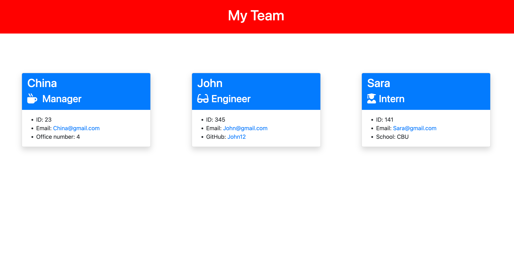

# team-profile-project
10-OOP

## Table of Contents
1. [Description](#Description)
2. [Installation](#Installation)
3. [Usage](#Usage)
4. [Tests](#Tests)
5. [Visuals](#Visuals)

## Description
This team profile generator project functions to generate an html page based on user input. This team consists a Manager, Employees, and Interns. When a user is prompted with questions via inquirer, these answers are generated into the html.   

## Installation
To install npm/inquirer-
Navigate to the index.js file, open the node console, and run: npm init -> npm install inquirer@8.2.4.

To install jest-
Navigate to the index.js file, open the node console, and run: npm i jest

## Usage
Run node index.js in the index.js file. After completing the questions, the generated html page will display the prompts answers in the html file.

## Tests
Test are performed through jest. 

## Visuals
